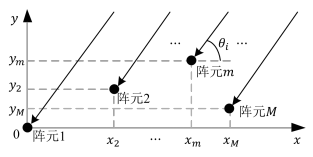
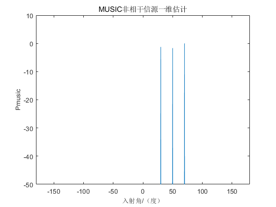

## MUSIC

### 学习目标

> - 谱估计的数学模型
> - 谱估计的基础知识：阵列方向图，波束宽度，分辨力
> - 信源数的估计

### 1 阵列信号模型

信号表示形式：
$$
\left\{ \begin{array}{l}
{s_i}(t) = {u_i}(t){e^{j({w_0}t + \varphi (t))}}\\
{s_i}(t - \tau ) = {u_i}(t - \tau ){e^{j({w_0}(t - \tau ) + \varphi (t - \tau ))}}
\end{array} \right. \tag{1.1}
$$
${u_i}(t)$为缓慢变化的幅度包络，$\varphi (t)$为接收信号的相位，${w_0}$为中心频率、

(1.1)由于窄带远场，可写为：
$$
\left\{\begin{array}{l}
u_{i}(t-\tau) \approx u_{i}(\mathrm{t}) \\
\varphi(t-\tau) \approx \varphi_{i}(\mathrm{t})
\end{array}\right.
$$

$$
s_{i}(t-\tau) \approx s_{i}(t) \mathrm{e}^{-j \omega_{0} \tau} \quad i=1,2, \cdots, N
$$


第 $l$ 个阵元接收信号为：
$$
x_{l}(t)=\sum_{i=1}^{N} g_{li} s_{i}\left(t-\tau_{li}\right)+n_{l}(t) \quad l=1,2, \cdots, M \tag{1.2}
$$
<font color=red size=3>$g_{li}$</font>     为第 $l$ 个阵元对第 $i$ 个信号源的增益

<font color=red size=3>$n_{l}(t)$</font> 为第 $l$ 个阵元在 $t$ 时刻的噪声

<font color=red size=3>$\tau_{li}$</font>      为第 $i$ 个信号到达第 $l$ 个阵元相对于参考阵元的时延

将M个阵元在某个特定时间 $t$ 接收的信号排成一个矩阵：

$$
\left[\begin{array}{c}
x_{1}(t) \\
x_{2}(t) \\
\vdots \\
x_{M}(t)
\end{array}\right]=\left[\begin{array}{cccc}
e^{-j \omega_{0} \tau_{11}} & e^{-j \omega_{0} \tau_{12}} & \cdots & e^{-j \omega_{0} \tau_{1 N}} \\
e^{-j \omega_{0} \tau_{21}} & e^{-j \omega_{0} \tau_{22}} & \cdots & e^{-j \omega_{0} \tau_{2 N}} \\
\vdots & \vdots & & \cdots \\
e^{-j \omega_{0} \tau_{M 1}} & e^{-j \omega_{0} \tau_{M 2}} & \cdots & e^{-j \omega_{0} \tau_{M N}}
\end{array}\right]\left[\begin{array}{c}
s_{1}(t) \\
s_{2}(t) \\
\vdots \\
s_{N}(t)
\end{array}\right]+\left[\begin{array}{c}
n_{1}(t) \\
n_{2}(t) \\
\vdots \\
n_{M}(t)
\end{array}\right]
$$
理想情况下，阵列中各阵元各向同性且不存在通道不一致、互耦等因素的影响。则 $g_{li}$ 归一化为1。所以写成矢量形式为：
$$
\boldsymbol{X}(t)=\boldsymbol{A S}(t)+\boldsymbol{N}(t) \tag{1.3}
$$
<font color=red size=3>$\boldsymbol{X}(t)$</font>  为阵列$M \times 1$ 维快拍数据矢量

<font color=red size=3>$\boldsymbol{N}(t)$</font>  为阵列$M \times 1$ 维加性噪声数据矢量

<font color=red size=3>$\boldsymbol{S}(t)$</font>  为空间信号的$N \times 1$维矢量

<font color=red size=3>$\mathbf{A} $</font>      为空间阵列的$M \times N$ 维流型矩阵（导向矢量阵）
$$
\boldsymbol{A}=\left[\begin{array}{llll}
\boldsymbol{a}_{1}\left(\omega_{0}\right) & \boldsymbol{a}_{2}\left(\omega_{0}\right) & \cdots & \boldsymbol{a}_{N}\left(\omega_{0}\right)
\end{array}\right]
$$

$$
a_{i}\left(\omega_{0}\right)=\left[\begin{array}{c}
\exp \left(-j \omega_{0} \tau_{1 i}\right) \\
\exp \left(-j \omega_{0} \tau_{2 i}\right) \\
\vdots \\
\exp \left(-j \omega_{0} \tau_{M i}\right)
\end{array}\right] \quad i=1,2, \cdots, N
$$

$\omega_{0}=2 \pi f=2 \pi \frac{c}{\lambda}$，$c$ 为光速，$\lambda$为波长。**此时，对于 $a_{i}\left(\omega_{0}\right)$ ，由于都是第i个波形，所以来波的到达方位角都是确定的，可以确定为$\theta_{i}$**。又可写为：
$$
\mathbf{A}=\left[\mathbf{a}\left(\theta_{1}\right) \quad \mathbf{a}\left(\theta_{2}\right) \quad \cdots \quad \mathbf{a}\left(\theta_{N}\right)\right]
$$

$$
\mathbf{a}\left(\theta_{i}\right)=\left[\begin{array}{c}
\exp \left(-\mathrm{j} \omega_{0} \tau_{1 i}\right) \\
\exp \left(-\mathrm{j} \omega_{0} \tau_{2 i}\right) \\
\vdots \\
\exp \left(-\mathrm{j} \omega_{0} \tau_{M i}\right)
\end{array}\right] i=1,2, \ldots, N
$$

### 2 阵列分布

当阵列几何结构如下图所示时：



$\theta_{i}$：表示第 𝑖(𝑖 = 1,2, … , 𝑁)个信号的入射方向

$\tau_{li}$：号从$\theta_{i}$方向入射到第𝑚个阵元相对于参考阵元的时延（波程差/c）
$$
\tau_{m i}=\frac{1}{c}\left(x_{m} \cos \theta_{i}+y_{m} \sin \theta_{i}\right)
$$
参考阵元为坐标原点，$\left(x_{m}, y_{m}\right)$ 为第𝑚个阵元的坐标。

### 3 算法

MUSIC 算法是 Schmidt 等人于 1979 年提出的高分辨率的子空间类 DOA 估计算法。该算法利用阵列输出数据的二阶协方差矩阵的特征值分解，根据信号子空间与噪 声子空间的正交特征建立谱函数，搜索谱峰实现信号的 DOA 估计。它的出现突破了传统 DOA 估计算法中瑞利限的限制。

远场窄带信号的阵列接收数据表示为：
$$
\boldsymbol{X}(t)=\boldsymbol{A S}(t)+\boldsymbol{N}(t) 
$$
阵列数据的协方差矩阵为：
$$
\mathbf{R}=\mathrm{E}\left[\mathbf{X} \mathbf{X}^{H}\right]=\mathbf{A E}\left[\mathbf{S S}^{H}\right] \mathbf{A}^{H}+\mathrm{E}\left[\mathbf{N N}^{H}\right]=\mathbf{A} \mathbf{R}_{\mathrm{ss}} \mathbf{A}^{H}+\mathbf{R}_{\mathrm{NN}}
$$
$\mathbf{R}_{\mathrm{ss}}=\mathrm{E}\left[\mathbf{S S}^{H}\right]$表示信号源协方差矩阵，E[∙]表示信号的数学期望运算，$[\cdot]^{H}$表示 复共轭转置运算，$\mathbf{R}_{\mathrm{NN}}$表示噪声协方差矩阵，对于理想噪声的协方差矩阵可以用 $\mathbf{R}_{\mathrm{NN}}=\sigma^{2} \mathbf{I}$来表示，其中𝜎为噪声功率，𝐈为M × M维的单位矩阵。

假设阵列接收数据的快拍数为 L，采样时刻𝑡可表示为𝑡 = 1,2, … , 𝐿，则阵列接收数据二阶协方差矩阵𝐑的样本最大似然估计量为：
$$
\widehat{\mathbf{R}}=\frac{1}{L} \sum_{i=1}^{L} \mathbf{X} \mathbf{X}^{H}
$$
对$\widehat{\mathbf{R}}$特征分解：
$$
\widehat{\mathbf{R}}=\widehat{\mathbf{U}} \boldsymbol{\Lambda} \widehat{\mathbf{U}}^{H}
$$
其中，$\widehat{\mathbf{U}}$为特征矢量矩阵，𝚲为特征值组成的对角阵可以表示为：
$$
\boldsymbol{\Lambda}=\left[\begin{array}{llll}
\lambda_{1} & & & \\
& \lambda_{2} & & \\
& & \ddots & \\
& & & \lambda_{M}
\end{array}\right]
$$
式中特征值的大小满足：
$$
\lambda_{1} \geq \lambda_{2} \geq \cdots \geq \lambda_{N} \geq \lambda_{N+1}=\cdots=\lambda_{M}=\sigma^{2}
$$
定义矩阵$\boldsymbol{\Lambda}_{\mathrm{S}}$和$\boldsymbol{\Lambda}_{\mathrm{N}}$分别表示大特征值和小特征值构成的对角阵:
$$
\Lambda_{\mathrm{S}}=\left[\begin{array}{llll}
\lambda_{1} & & & \\
& \lambda_{2} & & \\
& & \ddots & \\
& & & \lambda_{N}
\end{array}\right]
$$

$$
\boldsymbol{\Lambda}_{\mathrm{N}}=\left[\begin{array}{llll}
\lambda_{N+1} & & & \\
& \lambda_{N+2} & & \\
& & \ddots & \\
& & & \lambda_{M}
\end{array}\right]
$$

将特征值矢量矩阵分解：大特征值对应的信号子空间$\widehat{\mathbf{U}}_{\mathrm{S}}=\left[\begin{array}{llll}
\boldsymbol{e}_{1} & \boldsymbol{e}_{2} & \cdots & \boldsymbol{e}_{N}
\end{array}\right] $；小特征值对应的噪声子空间$\widehat{\mathbf{U}}_{\mathrm{N}}=\left[\begin{array}{llll}
\boldsymbol{e}_{N+1} & \boldsymbol{e}_{N+2} & \cdots & \boldsymbol{e}_{M}
\end{array}\right] $
$$
\begin{array}{l}
R = \sum\limits_{i = 1}^N {{\lambda _i}{e_i}e_i^H}  + \sum\limits_{j = N + 1}^M {{\lambda _j}{e_j}e_j^H}  = [{U_s}{\rm{  }}{U_N}]\Sigma {[{U_s}{\rm{  }}{U_N}]^H}\\
{\rm{    = }}{U_s}{\Sigma _s}U_s^H + {U_N}\Sigma U_N^H
\end{array}
$$
**由于信号子空间与导向矢量的张成的空间是同一个空间**，即：
$$
span\{ {e_1}{\rm{ }}{e_2}{\rm{ }} \cdots {\rm{ }}{e_N}\}  = span\{ {a_1}{\rm{ }}{a_2}{\rm{ }} \cdots {\rm{ }}{a_N}\} 
$$
信号子空间与噪声子空间正交：
$$
\mathbf{a}^{H}\left(\theta_{i}\right) \widehat{\mathbf{U}}_{\mathrm{N}}=0，i=1,2, \ldots, N
$$
求DOA以最小优化搜索实现：

<font color=red size=3>$\theta：为搜索的范围一般是-90：1：90，步长为1°$</font>  :
$$
{\theta _{MUSIC}} = {\arg _\theta }\min {a^H}(\theta ){{\hat U}_N}\hat U_N^Ha(\theta )
$$
MUSIC的谱估计为：
$$
{P_{MUSIC}} = \frac{1}{{{a^H}(\theta ){{\hat U}_N}\hat U_N^Ha(\theta )}}
$$

#### 4 仿真

```matlab
Main.m             %主函数
A_theta.m          %产生导向矢量
MUSIC_Trandition.m %传统的MUSIC
```

仿真条件：非相干信号源，无加性噪声，3个信号源，一维角度估计，目标无速度



